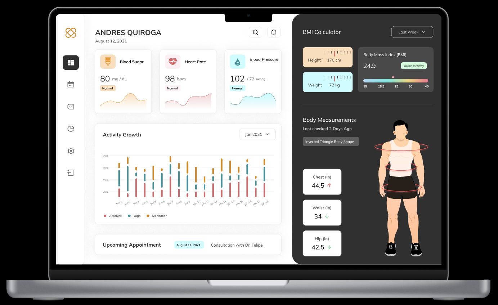
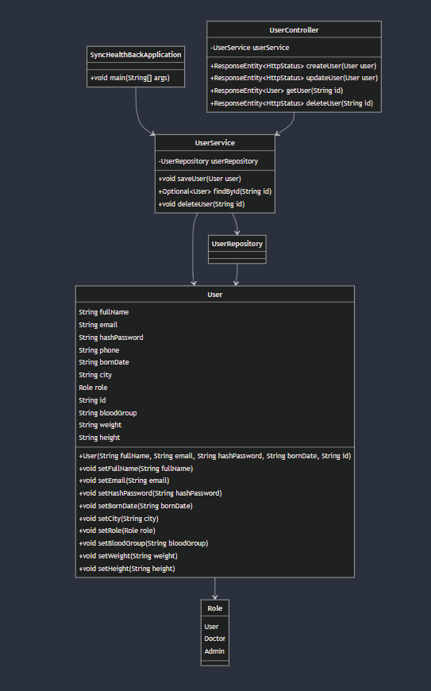

# SyncHealthBack

SyncHealth is a application developed using Spring Boot and MongoDB to manage users in a health tracking system. The system supports basic CRUD (Create, Read, Update, Delete) operations for users, and it's structured with a clear service-oriented architecture.

## Features

- **User Management**: Allows for creating, reading, updating, and deleting user information.
- **REST API**: Exposes endpoints for interacting with the user data.
- **MongoDB Integration**: The user data is stored and retrieved from a MongoDB database.
- **Role-based Access**: Supports different user roles such as `PATIENT`, `DOCTOR`, and `ADMIN`.
- **Unit Testing**: Includes extensive unit tests for the models, services, and controllers.

## Getting Started

Follow the instructions below to set up and run the project on your local machine.

### Prerequisites

Ensure you have the following installed:

1. **Java** (version 8 or later)
    ```bash
    java -version
    ```

2. **Maven**
    - Install Maven by following the instructions [here](https://maven.apache.org/install.html).
    - Verify installation:
    ```bash
    mvn -version
    ```

3. **MongoDB**
    - Install MongoDB from [here](https://www.mongodb.com/try/download/community).
    - Start MongoDB service:
    ```bash
    mongod
    ```

4. **Git**
    - Install Git from [here](https://git-scm.com/book/en/v2/Getting-Started-Installing-Git).
    - Verify installation:
    ```bash
    git --version
    ```

### Installation

1. **Clone the repository**:
    ```bash
    git clone https://github.com/SmartWatchIETI/SyncHealth.git
    cd SyncHealth
    cd SyncHealthBack
    ```

2. **Build the project**:
    ```bash
    mvn clean install
    ```

3. **Run the application**:
    ```bash
    mvn spring-boot:run
    ```

## Prototype

The [**SyncHealthBack**](https://www.figma.com/proto/KzAcyqZtsIGYHxperjXCCo/Healthcare-Dashboard-(Community)?node-id=1111-7&node-type=frame&t=8fBpK5eH2RDJCBkh-0&scaling=scale-down&content-scaling=fixed&page-id=0%3A1) prototype is a backend application designed to manage user data in a health tracking system. 

[](https://www.figma.com/proto/KzAcyqZtsIGYHxperjXCCo/Healthcare-Dashboard-(Community)?node-id=1111-7&node-type=frame&t=8fBpK5eH2RDJCBkh-0&scaling=scale-down&content-scaling=fixed&page-id=0%3A1)


4. **Access the API**: The application will be running on `http://localhost:8080`.

## API Endpoints

To test the following endpoints, you will need to use a tool like **Postman**. Make sure to install **Postman**, and then:

1. Enter the endpoint URL.
2. Select the appropriate HTTP method (POST, GET, PUT, DELETE).
3. Add the request body (if required) in JSON format.
4. Send the request to get a response from the server.

### User Management

#### Create a User:
**POST** `/api/users/create`

This endpoint creates a new user in the system.

**Request Body (JSON)**:

```json
{
  "fullName": "John Doe",
  "email": "john.doe@example.com",
  "hashPassword": "hashedPassword",
  "bornDate": "1990-01-01",
  "id": "1"
}
```

#### Get a User:
**GET** `/api/users/get/{id}`

This endpoint retrieves a user by their ID.

#### Update a User:
**PUT** `/api/users/update`

This endpoint updates an existing user's details.

**Request Body (JSON)**:

```json
{
  "id": "1",
  "city": "New York",
  "phone": "555-1234",
  "bloodGroup": "O+",
  "weight": "70kg",
  "height": "180cm"
}
```

#### Delete a User:
**DELETE** `/api/users/delete/{id}`

This endpoint deletes a user from the system by their ID.

## Running Tests

The project includes unit tests to verify the functionality of the controllers, services, and models.

Run the tests with the following command:
```bash
mvn test
```

The tests cover:

- User model initialization and validation
- Service methods for saving, finding, and deleting users
- Controller methods for handling API requests

## Project Structure

[](https://mermaid.live/view#pako:eNqVVV1v2jAU_SuWn4IaUCChsDxMKqUbe9km0DRpYw9ubBKrxo5spx1F8NvnJHyYxHSqH5LY9_jcj2PfbGEiMIExTBhSakpRKtF6yYEZ1QpYbHgyI4jpbIKSp7s8ZzRBmgoOtjWsHDfPgmKwRpR7Cy0pT3__AUimqlNDdvXLpv2hiFwQ-UwTYhN1y_U5yYWiWsgNKC6mTYcKPZNyg1c-KmzHgnzLyzAR25fWPVhRjiebL_gQIaC40-TDhBFdMzZBV1KwQt2egE2QneCBd1Uw9hWtSctATBFZazVDKvtu6F6ExC1jngneJnoUkk-RbhsSqq1CzgUjQJpHC0fbnh6ZEPizFEXeMr0Qmma6HXhj-cYu7rEI_kXyvitpv5mWD67LqIj-dKBuunJhH0qvnh2CCzWzovEcEbr2TA7Beo3gXdh7I4tnSeTClGJ5J8WcHk8KeS3NXPiflT7ehYjO7C9wmY1zHPh7wbWJkF0e_a5954vzt-VuTlQuuCIPXJsS7Gda5wuNdKH2IJEE6Tdu-xtbixy_Z2vdLlKinY3gf87e10MqMa0alfvOs6lITGs5z-_wmnIH1_Ue3e1-tFttDbd1OAKaTdaFOVssga96sFpjm6BaKpOHPlwTaS4dNv-gqhBLqDNiOiOMzSdG8mkJl3xncKjQoswUxloWxIfmTKcZjFeIKTOrRT78wI6QHPFfQthTGG_hXxiHt6Nefxj1x2E0CIdRMAx9uIFxNwp6ozD6EAzCKAgH40Ew3PnwtaLo94Jq9A2-PxoPb3f_ACTzT90)
## Technologies Used

- **Spring Boot**: Application framework for building REST APIs.
- **MongoDB**: NoSQL database for storing user data.
- **Maven**: Dependency management and project build tool.
- **JUnit 5**: Testing framework for unit tests.

## License

This project is licensed under the MIT License - see the [LICENSE](LICENSE.txt) file for details.

## Authors

- [**Andres Arias Ajiaco**](https://github.com/andresarias02)
- [**Daniel Rojas Hernandez**](https://github.com/knight072)
- [**Johann Amaya Lopez**](https://github.com/JohannBulls)
- [**Sebastian Blanco Rodriguez**](https://github.com/sebastian2929)
- [**Sebastian Zamora Urrego**](https://github.com/SebZaUr)

